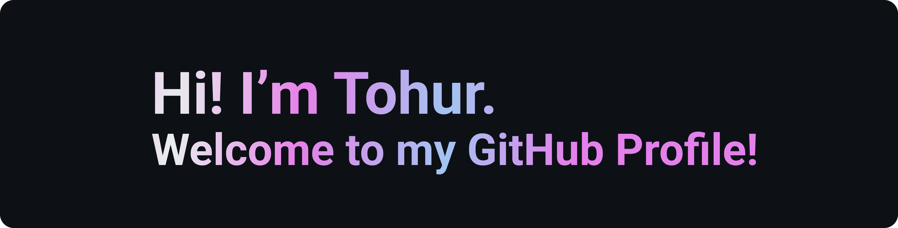

## 🧑‍💻 About Me:

:white_small_square: [Check Out My Website](http://www.tohur.com/) :white_small_square:

- 🌍 Based in New York.
- 🎓 Computer Science graduate.
- 💼 Application Developer at [BastionX](https://www.bastionx.io/).
- 📫 Feel free to connect with me on [LinkedIn](https://www.linkedin.com/in/tohur-rahman/).
- 💬 Lets chat on [Discord](https://discord.gg/DWhhXT3yaz).

## 🧰 Languages and Tools:

  &nbsp;
  &nbsp;
  &nbsp;
  &nbsp;
  &nbsp;
  &nbsp;
  &nbsp;
  &nbsp;
  &nbsp;
  &nbsp;
  &nbsp;
  &nbsp;
  &nbsp;
  &nbsp;
  &nbsp;

## 🎨 Hobbies:

- ⚽️ Soccer enthusiast
- 🖌️ Enjoy creating and designing
- 📖 Passionate about continuous learning
---
